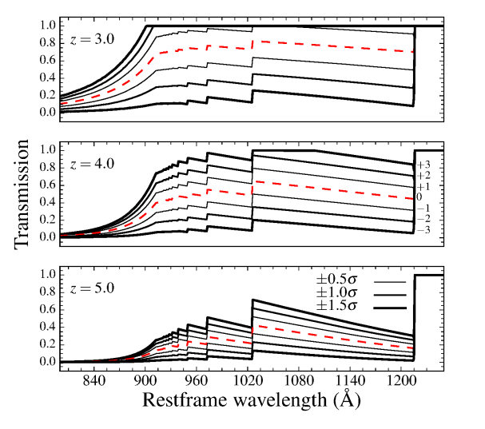

Igm ism
=======

Igm
---

Meiksin curves are used to reproduce IGM extinction.
Different meiksin curves are defined on the redshift bin.
For each redshift bin, 7 extinction curves are defined: one "mean" curve, and +/- 0.5, 1, 1.5 :math:`\sigma`

